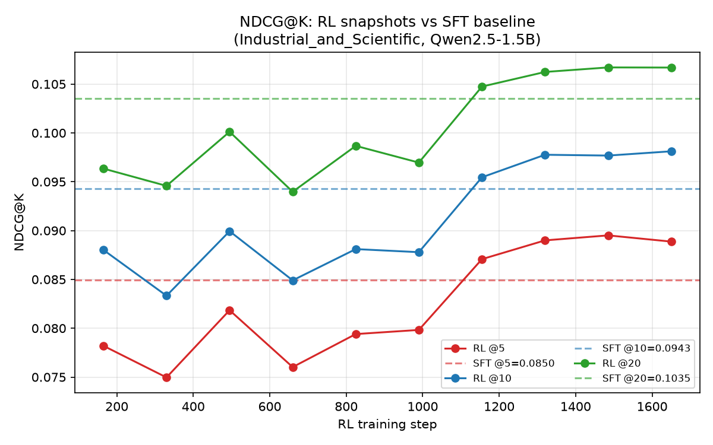

# MiniOneRec-Qwen1.5B：生成式商品推荐复现

基于 Amazon Review 2018 `Industrial_and_Scientific` 子集的生成式推荐研究复现。项目以 Qwen2.5-1.5B 为骨干，将下一物品预测改写为多层 Semantic ID（SID）自回归生成，并覆盖 SID 构建、SFT、GRPO、合法路径约束 Beam Search 和 Top-K 离线评测。

> 本仓库是离线研究流水线，不是线上电商服务。代码基于 [AkaliKong/MiniOneRec](https://github.com/AkaliKong/MiniOneRec)（Apache-2.0）扩展，主要工作是 1.5B 单卡适配、SID 量化对比、码本均衡实验、CRID-inspired 排序 SID 和可复现评测整理。

## 项目亮点

- 端到端链路：商品文本嵌入 → Semantic ID → SFT → GRPO → constrained Beam Search → HR/NDCG@K。
- SID 量化：FAISS RQ-KMeans、Constrained/Balanced RQ-KMeans、RQ-VAE、RQ-KMeans++、Sinkhorn RQ-VAE、dead-code reset 和 CVQ-style online codebook。
- 码本诊断：统计碰撞率、利用率、normalized perplexity 和 load CV，分析偏载、死码及码本塌陷。
- 排序型 SID：保留两级语义前缀，以训练集交互频次作为业务价值 proxy 构造簇内 rank token。
- 推荐强化学习：命中奖励与 rank-aware reward 组合，并在训练和推理阶段限制生成到合法 SID 路径。

## 主实验结果

数据集含 3,686 个商品和 4,533 条测试样本；推理使用 50 beams，所有主实验无效路径数 `CC=0`。

| 模型 | HR@3 | NDCG@3 | HR@5 | NDCG@5 | HR@10 | NDCG@10 |
|---|---:|---:|---:|---:|---:|---:|
| SFT | 0.0893 | 0.0772 | 0.1083 | 0.0850 | 0.1372 | 0.0943 |
| SFT + GRPO（step 1650） | **0.0938** | **0.0817** | **0.1112** | **0.0889** | **0.1401** | **0.0981** |
| 相对变化 | +4.94% | +5.87% | +2.65% | +4.60% | +2.09% | +4.03% |


CRID-inspired SID 相比 RQ-KMeans++：

- NDCG@10：0.099909 → 0.101377（+1.47%）
- HR@10：0.147143 → 0.149790（+1.80%）
- 完整 SID embedding 的 Parent/Leaf Category P@10：分别提升 13.18 / 6.64 个百分点



## 目录结构

```text
.
├── rq/                    # SID 量化器、RQ-VAE 与索引生成
├── tools/                 # SID 变体、类目一致性评测、绘图等工具
├── config/                # 单卡 DeepSpeed/Accelerate 配置
├── docs/                  # 完整实验报告与结果边界
├── artifacts/             # 轻量指标，不含模型和逐样本预测
├── data/README.md         # 所需数据格式与下载说明
├── sft.py / rl.py         # SFT 与 GRPO 训练
├── evaluate.py            # 合法 SID 约束 Beam Search
└── calc.py                # HR/NDCG@K 计算
```

## 快速开始

建议使用 Linux、Python 3.11 和一张约 48 GB 显存的 NVIDIA GPU。

```bash
conda create -n minionerec python=3.11 -y
conda activate minionerec

# 先按本机 CUDA 版本安装 PyTorch，再安装其余依赖
pip install -r requirements.txt

python tools/download_qwen.py
```

按 [`data/README.md`](data/README.md) 准备数据后：

```bash
bash convert_dataset.sh
bash sft.sh
bash rl.sh
bash evaluate.sh output/rl/Industrial_and_Scientific_plus/final_checkpoint
```

重新训练主 SID：

```bash
cd rq
bash rqkmeans_constrained.sh
bash rqkmeans_plus.sh
bash generate_indices_plus.sh ../output/rqkmeans_plus/<run>/best_collision_model.pth
```

## 实验边界

- 当前验证只覆盖 Amazon `Industrial_and_Scientific`，不代表多品类或线上业务效果。
- “业务价值”使用训练交互次数代理，不是 GMV、CTR 或 CVR。
- Category Precision 使用 SFT 后 SID token embedding，不能单独归因于量化器。
- 数据、Qwen 权重、训练 checkpoint 和逐样本预测不提交 GitHub；它们体积较大且受各自数据/模型许可证约束。

更完整的量化对比和 CRID 实验见 [`docs/SID_QUANTIZATION_EXPERIMENTS.md`](docs/SID_QUANTIZATION_EXPERIMENTS.md) 与 [`docs/CRID_POPULARITY_EXPERIMENT.md`](docs/CRID_POPULARITY_EXPERIMENT.md)。

## 致谢与许可证

本项目基于 MiniOneRec 扩展。上游项目采用 Apache License 2.0，本仓库保留相同许可证；引用或使用时请同时注明上游工作。论文信息见原项目 README。
